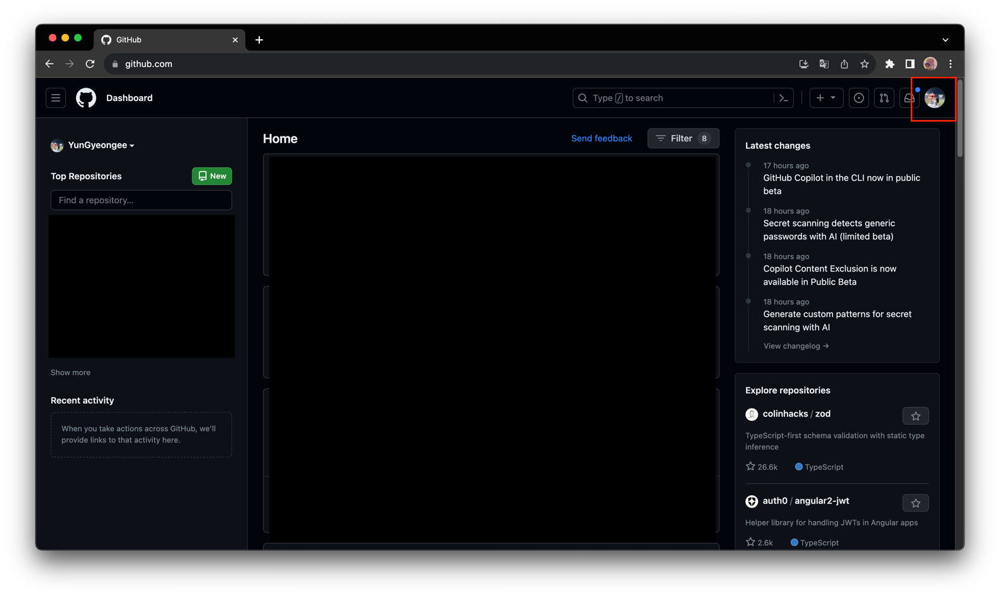
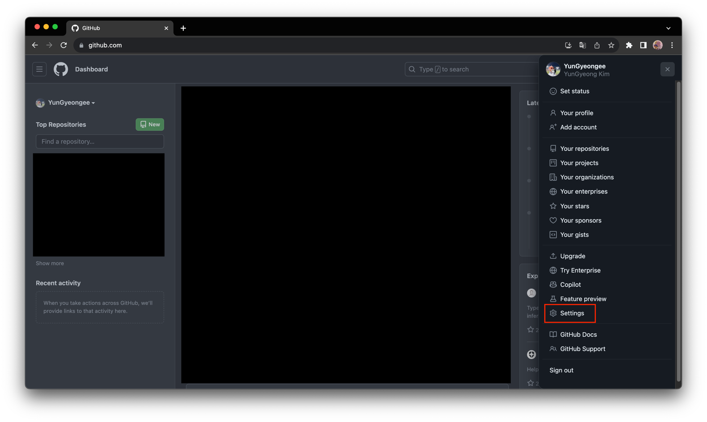
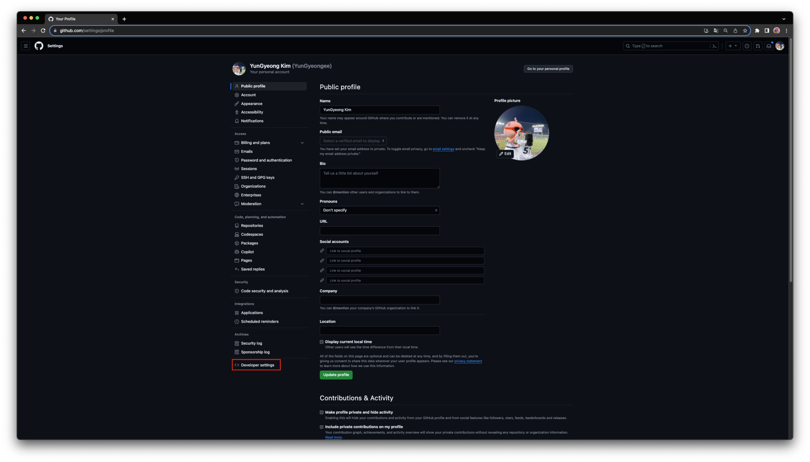
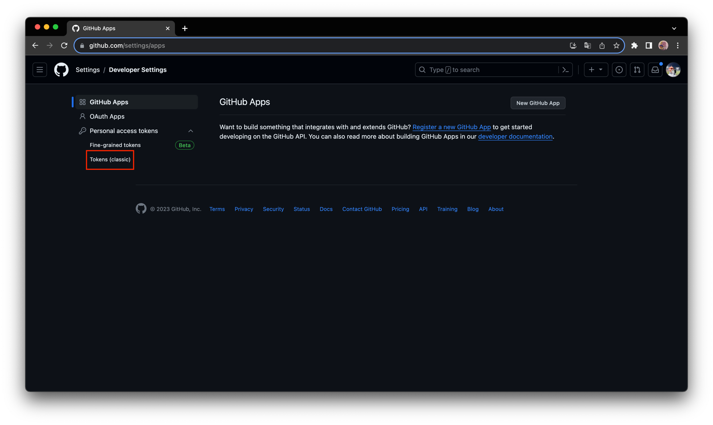
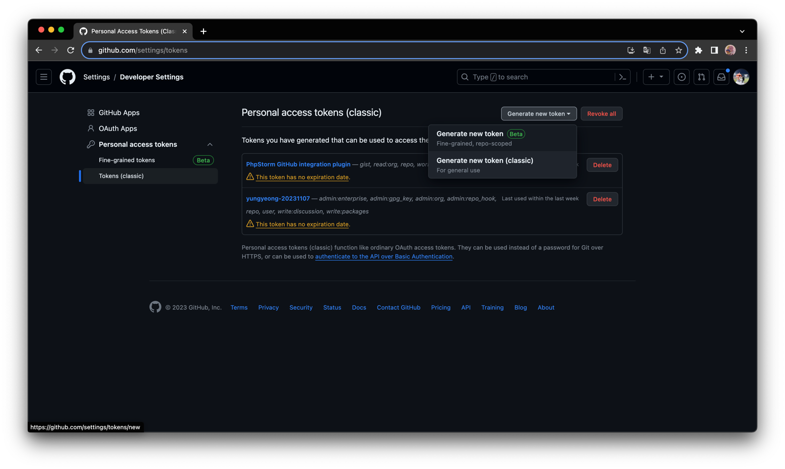

# github token 새로 발급 받는 방법

## github 토큰 생성 방법

1. https://github.com 접속 후 오른쪽 상단 프로필 선택
   
2. Settings
   
3. Developer settings
   
4. Personal access tokens - Tokens (classic)
   
5. Generate new token - Generate new token (classic)
   

6. 비밀번호 입력 후 토큰 이름 및 기간, 권한 설정 후 저장
7. 창 닫은 이후에는 노출되지 않기 때문에 ⭐️생성된 토큰은 메모장 등에 꼭 복사해놓기 ⭐️
